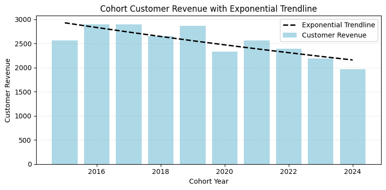

# Customer Segmentation, Cohort & Retention Analysis for Contoso

## Overview  
This report looks at customer spending, retention, and lifetime value. The aim is to understand how customers behave over time and find simple ways to improve revenue and keep them active.

## Clean Up Data ✨

**SQL Code:** [create_view.sql](https://github.com/PrikshitSingh230/Customer-Analysis-For-Contoso/blob/main/SQL_Query/Optimized_view.sql)

- Combined sales and customer details  
- Calculated first purchase dates for cohort analysis  
- Built a clean view for easier reporting  

---

## Analysis

### 1. Customer Segmentation 🔍

**SQL Code:** [Customer_Segmentation.sql](https://github.com/PrikshitSingh230/Customer-Analysis-For-Contoso/blob/main/SQL_Query/Customer_Segmentation.sql)

- Grouped customers into High, Mid, and Low value  
- Calculated lifetime value (LTV)  
- Summarized revenue contribution  

**Visualization**  

#### Key Findings  
- High-value customers (25%) drives 66% of total revenue($135.4M). 
- Mid-value customers (50%) contributes 32% of revenue($66.6M). 
- Low-value customers (25%) accounts only 2% of revenue($4.3M). 

#### Insights 💡  
- Give high-value customers early access, faster support, or special perks as losing even a single one will significantly affect the revenue.  
- Offer mid-value customers bundle deals or targeted discounts so that can be upgraded into high-value customer.  
- Encourage low-value customers with simple promo codes or loyalty points.  
- Track month-to-month activity for each segment to catch early drop-off.

---

### 2. Customer Revenue by Cohort 📅

**SQL Code:** [cohort_analysis.sql](https://github.com/PrikshitSingh230/Customer-Analysis-For-Contoso/blob/main/SQL_Query/cohort_analysis.sql)

- Grouped customers by first purchase year  
- Measured revenue and customer counts per cohort  
- Compared long-term trends  

**Visualizations**  
  

#### Key Findings  
- Older cohorts (2016–2018) spent around $2,800+, while the 2024 cohort spent ~$1,970.  
- Revenue and customers peaked in 2022–2023.  
- 2024 shows a clear downward trend in both spending and customers.  

#### Insights 📎  
- Re-engage newer cohorts (2022–2024) before they churn.  
- Use loyalty or subscription programs to reduce revenue swings.  
- Apply winning strategies from older high-spending cohorts to new ones.  
- Watch monthly dips closely to plan marketing around slow periods.

---

### 3. Customer Retention 🔁

**SQL Code:** [retention_analysis.sql](https://github.com/PrikshitSingh230/Customer-Analysis-For-Contoso/blob/main/SQL_Query/retention_analysis.sql)

- Identified inactive and at-risk customers  
- Analyzed last purchase dates  
- Measured retention across cohorts  

**Visualization**  

#### Key Findings  
- After 2–3 years, cohorts settle at ~90% churn.  
- Only 8–10% of customers stay active long-term.  
- Newer cohorts follow the same pattern.  

#### Insights 🧭  
- Improve early customer experience to keep them engaged in year 1.  
- Focus win-back campaigns on high-value churned customers.  
- Use early signals (no purchases in 60–90 days) to alert the team.  
- Send small rewards after the first order to push customers toward their second purchase quickly.

---

## Strategic Recommendations 🚀

### 1. Customer Value Optimization
- Build a simple VIP program for top customers.  
- Give mid-value customers personalized upgrade deals.  
- Use price-friendly offers for low-value customers.  
- Add automated reminders based on past buying patterns.  

### 2. Cohort Performance Strategy
- Re-engage 2022–2024 cohorts with targeted offers.  
- Use loyalty/subscription options to reduce revenue drops.  
- Copy best tactics from older strong cohorts.  
- Track seasonal changes and time campaigns better.  

### 3. Retention & Churn Prevention
- Strengthen engagement in the first 1–2 years.  
- Run win-back campaigns for valuable inactive users.  
- Set up alerts for at-risk customers.  
- Give small early rewards to build repeat habits.  

---

## Tools Used 🛠️
- **Database:** PostgreSQL  
- **Tools Used:** PostgreSQL, DBeaver
- **Visualisation:** Jupyter NoteBook , Python  
